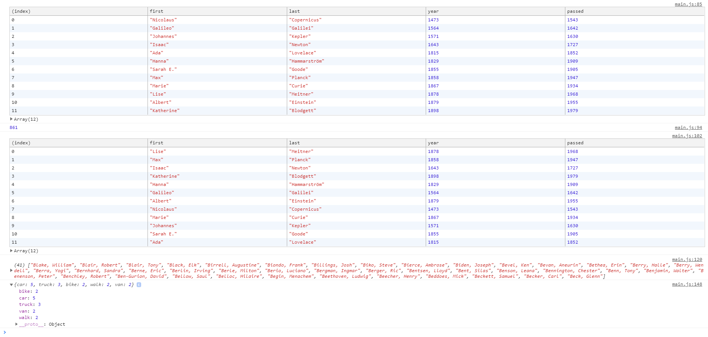

### Array Cardio Day 1

##### Things that i learned :

- console.table .([Check the link for more](https://developer.mozilla.org/en-US/docs/Web/API/Console/table))
  

- array.sort((a, b) => Compare two value in a and b) ([Check the link for more](https://developer.mozilla.org/tr/docs/Web/JavaScript/Reference/Global_Objects/Array/sort))

- data.reduce (Details)([Check the link for more](https://developer.mozilla.org/en-US/docs/Web/JavaScript/Reference/Global_Objects/Array/Reduce))
