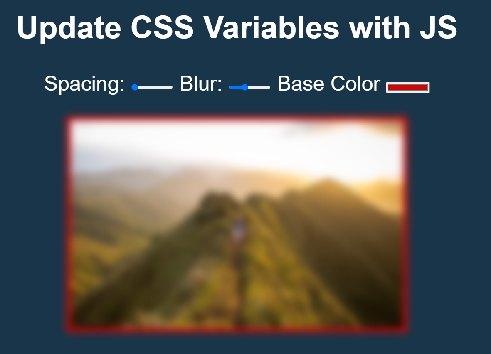

### Scoped CSS Variables and JS

##### Things that i learned :

- Define CSS Variables in ":root"([Check the link for more](https://developer.mozilla.org/tr/docs/Web/CSS/:root))
- const suffix = this.dataset (gives all data attribute on html)([Check the link for more](https://developer.mozilla.org/en-US/docs/Web/API/HTMLOrForeignElement/dataset))
  -document.documentElement.style.setProperty (update css variable with this method)([Check the link for more](https://developer.mozilla.org/en-US/docs/Web/API/CSSStyleDeclaration/setProperty))
