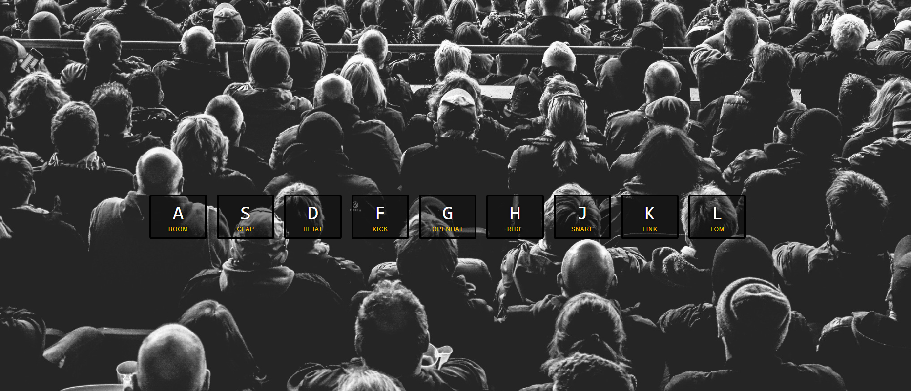

### JavaScript Drum Kit

##### Things that i learned :

- HTMLElement: "transitionend" event.([Check the link for more](https://developer.mozilla.org/en-US/docs/Web/API/HTMLElement/transitionend_event))
- "audio": The Embed Audio element ([Check the link for more](https://developer.mozilla.org/en-US/docs/Web/HTML/Element/audio))
- HTML data-* Attribute ([Check the link for more](https://www.w3schools.com/tags/att_data-.asp))
